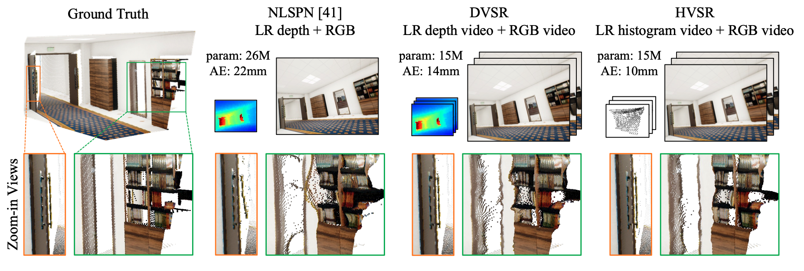

Code and data release for the manuscript "[Consistent Direct Time-of-Flight Video Depth Super-Resolution]" (CVPR 2023)

[Zhanghao Sun], [Wei Ye], [Jinhui Xiong], [Gyeongmin Choe], [Jialiang Wang], [Shuochen Su], [Rakesh Ranjan].

## [Project], [Paper], [Video], [Dataset]

[Consistent Direct Time-of-Flight Video Depth Super-Resolution]: https://arxiv.org/abs/2211.08658
[Zhanghao Sun]: https://zhsun0357.github.io/
[Wei Ye]: https://ywwwer.github.io/
[Jinhui Xiong]: https://jhxiong.github.io/
[Gyeongmin Choe]: https://www.chrisgchoe.com/
[Jialiang Wang]: https://sites.google.com/view/jialiangwang/home
[Shuochen Su]: https://shuochsu.github.io/
[Rakesh Ranjan]: https://openreview.net/profile?id=~Rakesh_Ranjan2

[Paper]: https://arxiv.org/abs/2211.08658.pdf
[Video]: https://www.youtube.com/watch?v=77LTIDqhBjA
[Project]: https://zhsun0357.github.io/consistent_dtof_video/
[Dataset]: https://drive.google.com/drive/u/0/folders/19MT7dhJaMkVd6y5QHywWqjZRNN08-XPU/

## 08/16/2023: Supports inference with less GPU memory
## 04/17/2023: Dataset is released.
## 04/03/2023: Updated demo scripts.

## Highlights:
+ Multi-view depth video enhancement, no need for camera pose.
+ Large improvement over single-frame SOTA algorithms.
+ Synthetic video depth dataset (45k frames), with diverse environment and dynamic objects (depth, surface normal, RGB, albedo).

## Introduction
Direct time-of-flight (dToF) sensors are promising for next-generation on-device 3D sensing. However, limited by manufacturing capabilities in a compact module, the dToF data has low spatial resolution (e.g., ~20x30 for iPhone dToF), and it requires a super-resolution step before being passed to downstream tasks. In this paper, we solve this super-resolution problem by fusing the low-resolution dToF data with the corresponding high-resolution RGB guidance. Unlike the conventional RGB-guided depth enhancement approaches which perform the fusion in a per-frame manner, we propose the first multi-frame fusion scheme to mitigate the spatial ambiguity resulting from the low-resolution dToF imaging. In addition, dToF sensors provide unique depth histogram information for each local patch, and we incorporate this dToF-specific feature in our network design to further alleviate spatial ambiguity. To evaluate our models on complex dynamic indoor environments and to provide a large-scale dToF sensor dataset, we introduce DyDToF, the first synthetic RGB-dToF video dataset that features dynamic objects and a realistic dToF simulator following the physical imaging process. We believe the methods and dataset are beneficial to a broad community as dToF depth sensing is becoming mainstream on mobile devices.

For more details of our work, please refer to our project page and technical paper.




## Requirements Installation
Our code is based on PyTorch1.12.1+cu113 and [OpenMMLab], and adapted from [MMEditing]. Please run:

    conda create --name dvsr python=3.8 -y
    conda activate dvsr
    pip install scipy pyyaml terminaltables natsort
    pip install torch==1.12.1+cu113 torchvision==0.13.1+cu113 torchaudio==0.12.1 --extra-index-url https://download.pytorch.org/whl/cu113 # pytorch
    pip install mmcv-full==1.7.0 -f https://download.openmmlab.com/mmcv/dist/cu113/torch1.12/index.html # mmcv
    pip install mmsegmentation==0.29.1 # mmseg
    pip install tqdm

[OpenMMLab]: https://github.com/open-mmlab
[MMEditing]: https://github.com/open-mmlab/mmediting

Our pretrained models are in ["chkpts" folder]. We use the pretrained SpyNet from OpenMMLab (stored in ["pretrained" folder]) when training our full network from scratch.

**NOTE**: our pretrained networks only take in scaled depth values between 0-1.

["chkpts" folder]: ./chkpts
["pretrained" folder]: ./pretrained

## Demo: Replica Synthetic Data
We generate a RGB-dToF video [sequence] from [Replica Dataset] following the image formation model (Eqn.1 in our paper). Please first download and put into "data/demo_dvsr" folder, then run:

    bash demo_replica.sh
for DVSR (depth video super-resolution) and HVSR (histogram video super-resolution) demo.

Super-resolved depth maps are stored in "results" folder as npy files.

[Replica Dataset]: https://github.com/facebookresearch/Replica-Dataset
[sequence]: https://drive.google.com/drive/folders/1fTaK2emrow8inaNR_cnGcqX1Kqug8NOh?usp=sharing

## Demo: DyDToF Dynamitc Synthetic Data
We generate a RGB-dToF video [sequence](https://drive.google.com/drive/folders/1CUBjT7lV5EIAI8PWHPAQQJEgZlahnGtK?usp=sharing) (please first download and put into "data/demo_dydtof" folder) from our [DyDToF Dataset] following the image formation model (Eqn.1 in our paper), with **dynamic objects**. Please run:

    bash demo_dydtof.sh
 DyDToF dataset contains 100 video clips (45k frames). We provide RGB image, depth, albedo image, surface normal and camera trajectory for each video clip. For more information on DyDToF dataset, please refer to this [Readme] file.

[DyDToF Dataset]: https://drive.google.com/drive/folders/19MT7dhJaMkVd6y5QHywWqjZRNN08-XPU?usp=share_link
[Readme]: https://zhsun0357.github.io/consistent_dtof_video/data/readme.md

## Demo: Apple ARKit Real-world Data
We naively downsample the pre-processed [ARKit dToF data] as input to our DVSR network (please first download and put into "data/demo_arkit" folder). Compared to the high-resolution processing results provided by ARKit, DVSR achieves better temporal consistency and edge sharpness, while also corrects errors in the ARKit preprocessed data. Please run:

    bash demo_arkit.sh
Disclaimer: During training, we assume the dToF data is relatively clean and accurate. When big errors (e.g. completely missing an object) are present in Apple ARKit data, our model can fail.

[ARKit dToF data]: https://drive.google.com/drive/folders/1ntUU6S9UxUQDp8-y2n5vvtSeQd-zq9S1?usp=share_link

## Train:
You can use the following command to train the model:

    bash train_scripts/train.sh configs/<CONFIG_FILENAME> #NUM_GPUS
You can modify the training configurations in "configs/dvsr_config.py" or "configs/hvsr_config.py". We recommend to train on 8xGPU.

Previous to training, please first download the [TarTanAir] dataset and put it under "data/tartanair" folder. Please organize the dataset as follows. You can use our train/val [split]

```
data/tartanair
|
--- train_split.txt                             # training set split file
--- val_split.txt                               # validation set split file
--- val_small_split.txt                         # small validation set split file
--- color                                       # color image folder
|       --- scene1                              # scene
|       |      |
|       |      ---- sequence1                   # subset
|       |      |      |
|       |      |      --- 000000_left.png       # left color images
|       .      .      .
|       .      .      .
--- depth                                       # depth folder
|       --- scene1                              # scene
|       |      |
|       |      ---- sequence1                   # subset
|       |      |      |
|       |      |      --- 000000_left_depth.npy # left depth maps
|       .      .      .
|       .      .      .
```

[split]: ./data
[TarTanAir]: https://theairlab.org/tartanair-dataset/

## Citation:
If you find our code or dataset useful in your research, please consider citing our paper:

    @article{sun2022consistent,
      title={Consistent Direct Time-of-Flight Video Depth Super-Resolution},
      author={Sun, Zhanghao and Ye, Wei and Xiong, Jinhui and Choe, Gyeongmin and Wang, Jialiang and Su, Shuochen and Ranjan, Rakesh},
      journal={arXiv preprint arXiv:2211.08658},
      year={2022}
    }

## Disclaimer
The majority of DVSR is licensed under CC-BY-NC, however portions of the project are available under separate license terms: https://github.com/open-mmlab/mmcv and https://github.com/open-mmlab/mmediting are licensed under the Apache 2.0 license.
